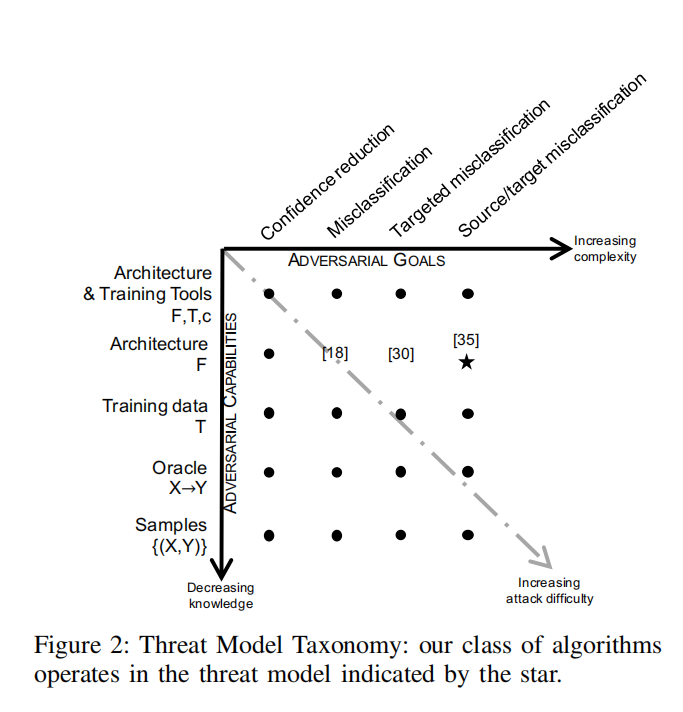
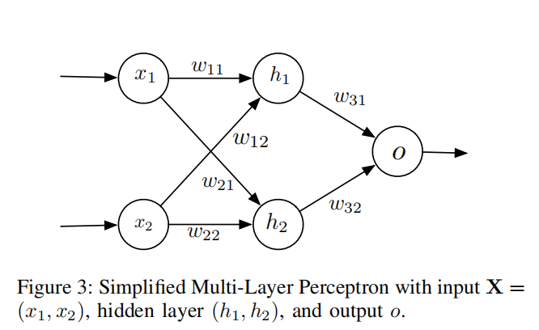
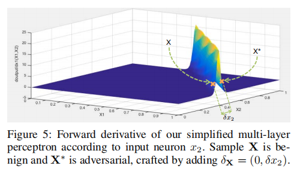
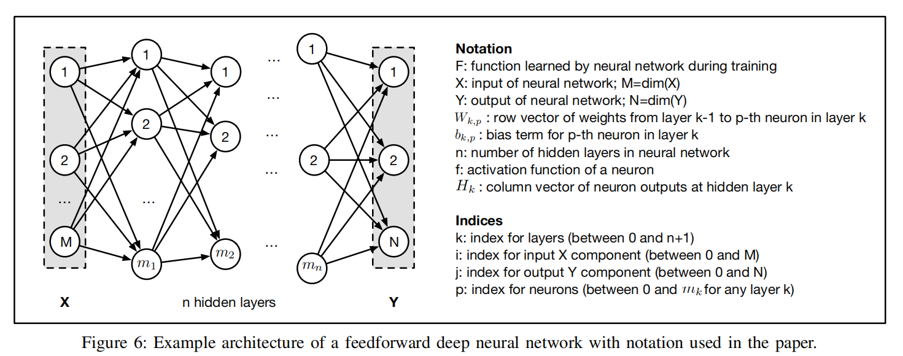
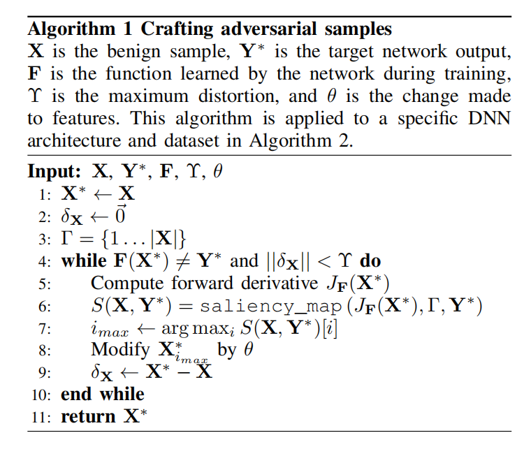
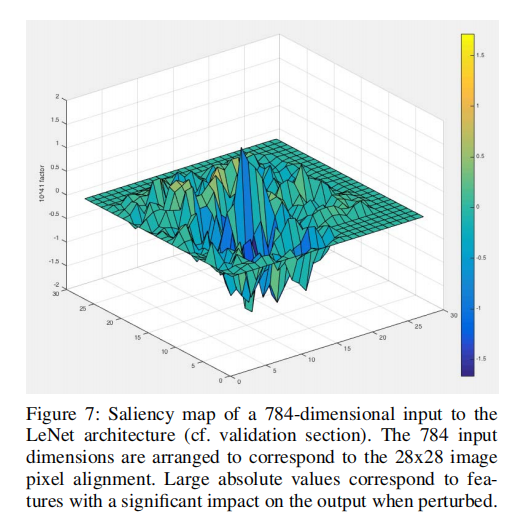

[TOC]

# The Limitations of Deep Learning in Adversarial Settings

## Abstract

深度学习利用 **大量数据和高效的算法** 展现出比别的机器学习任务更好的性能

但是训练阶段的缺点导致深度神经网络更容易受到对抗样本的攻击： 攻击者制作输入使得DNN误判

1. 针对DNN formalize the space of adversaries
2. 基于已完全了解的DNN的输入与输出的映射，提出了一种洗的算法来制作对抗样本
3. 在计算机视觉的应用中，展现 对抗样本 能被人类识别但无法被机器识别的概率高达97%
4. 通过定义一种 hardness measure 对不同样本类型进行对抗扰动的脆弱性进行了评估
5. 通过设定正常输入和目标分类之间的预测距离 进行初步的防御

## Introduction

**对抗样本** ：是一个特制的输入 能导致学习算法误判

利用DNN从有限训练集中学习到的不完全泛化，通过添加扰动，以及用于构建DNN中使用的大多数元件都有潜在的线度，从良性样本中创建对抗性样本

多维函数 $F:X->Y$ 其中$X$是一个原始特征向量，$Y$是输出数组
然后通过加上一个$\delta X$构建一个$X^*$

$arg \; \underset{{\delta X} }{\min}\;\rVert \delta X \rVert \;s.t. F(X+\delta X)=Y^* \qquad(1)$

其中$X^* \; = X +\delta X$
解决这个问题很重要，因为DNN通常是非线性和非凸

我们对输入的变化如何影响深度神经网络输出的理解源于前向导数（forward derivative）：我们引入并定义为DNN学习的函数的Jacobian矩阵。

为了生成能从DNN模型中获得理想结果的对抗样本，就用前向导数构造 包含扰动$\delta X$的对抗显著映射（adversarial saliency maps）

基于前向导数的方法比在先验系统中使用的梯度下降技术要强大得多：

- 适用于监督和无监督学习
- 能为广泛对抗样本族类生成信息

对抗显著性映射是基于前向导数的一个重要工具，并在设计时考虑到对抗性目标，在扰动的选择方面给予敌手更大的控制权

## Contribution

1. 在对抗性目标和能力方面，我们形式化了对手对分类器DNN的空间
2. 我们引入了一类新的算法，仅通过使用DNN架构的知识来制作对抗性样本
3. 我们使用一个广泛使用的计算机视觉DNN来验证了这些算法。

## Threat Model Taxonomy in Deep Learning（深度学习中的威胁模型分类）

  

### About Deep Neural Networks

深度神经网络是一种组织成神经元层的大型神经网络，对应于输入数据的连续表示。

DNN 又有两类 **监督**与**无监督**

- 监督训练导致使用从标记训练数据推断的函数将未见样本映射到预定义的输出集的模型
- 无监督训练学习未标记训练数据，由此产生的DNN模型可以用于生成新的样本，或者通过作为大型DNN的预处理层来自动化特征工程

 
$$\phi:X ->\dfrac{1}{1+e^{-x}} $$

$$Z_{h_1}(X) = \omega_{11}x_1+\omega_{12}x_2+b_1$$

$$h_1(X)=\phi(Z_{h_1}(X))$$

$$Z_{0}(X) = \omega_{31}h_1(X)+\omega_{32}h_2(X)+b_3$$

### Adversarial Goals（敌对目标）

1. Confidence reduction 降低输出置信度
2. Misclassification 将输出类改为与原类不同的类
3. Targeted misclassification 产生能强迫输出成为一个特定的目标类的输入
4. Source/target misclassification 强迫一个特定输入的输出分类导向一个特定的目标类

### Adversarial Capabilities（敌对能力）

敌手由其掌握的信息和能力定义

1. Training data and network architecture 敌手全知模型和训练数据
2. Network architecture 敌手知道网络架构及其参数值
3. Training data 敌手能获得训练集同分布的一个子集
4. Oracle 敌手能使用神经网络（能获得其输出）
5. Samples 敌手能获得神经网络的输入输出对

## Approach

提出了一个修改样本的通用算法，使DNN产生任何期望的敌对输出。

对模型结构及其参数的知识足够获得针对acyclic feedforward DNNs的敌对样本

这需要评估DNN的前向导数，以构建一个对抗性显著性映射，以识别与对手目标相关的输入特征集。

扰乱以这种方式识别的特征会迅速导致所需的对抗性输出，例如，错误的分类

虽然我们用监督分布式神经网络作为分类器来描述我们的方法，但它也适用于无监督架构。

### Studying a Simple Neural Network

上面对模型结构的阐述，展示了使用前向导数发现的小输入扰动是如何引起神经网络输出的大变化的。

输入偏差为$b_1,b_2,b_3(null)$

应得输出为$F(X) = x_1 \bigwedge x_2$ 其中$X = (x_1,x_2)$ 非整数会化成整数
从网络模型中可以得到$F(X)=Y$
然后对$X$添加一点扰动$\delta X$得到$X^*$($X^*$与$X$非常相似)，但$F(X^*)=Y^*\neq Y$

因此这个问题就变成如下最小化公式：找到最小的$\delta X$使得模型误判：
$$arg \; \underset{{\delta X} }{\min}\;\rVert \delta X \rVert \;s.t. F(X+\delta X)=Y^* \qquad(1)$$

这些扰动可以通过优化或者手动解决，但这些解决方法不适用与DNN，因其通常是非凸与非线性，因此提出一种基于向前导数的算法

将前向导数定义为神经网络在训练过程中学习的函数F的雅可比矩阵（Jacobian matrix）。
例如上面模型，可将雅各比矩阵化为如下形式
$$J_{F}(X)=[\dfrac{\partial F(X)}{\partial x_1},\dfrac{\partial F(X)}{\partial x_2}]$$

那么针对如上的式子，用可视化的手段可以得出在0和1之间有一道非常明显的鸿沟
  

因此，在敌手使用正向导数时，要专注于给定输入值的较大导数，让寻找更加有效，最终导向更小的扭曲

由上可得：

- 输入小的变动会导致神经网络输出极大变化
- 并不是所有的输入域都适合找到对抗样本
- 前向导数减小了对抗样本的寻找空间
  
### Generalizing to Deep Neural Networks

将上面的原理推广到 DNN模型中，对于任意无环的DNN
  

  

其基本步骤为：

1. 计算前向导数$J_F(X^*)$
2. 基于前向导数构建一个显著图$S$
3. 通过$\theta$修改输入特征$i_{max}$
4. 重复123直到获得$Y^*$或者到达最大扰动$\Upsilon$

#### Forward Derivative of a Deep Neural Network

第一步就是对给定的样本$X$计算前向导数，如下

$J_{F}(X)=[\dfrac{\partial F(X)}{\partial X}] =[\dfrac{\partial F_{j}(X)}{\partial x_i}]_{i\in 1...M,j\in 1...N}$

这个与神经网络的反向传播很像，但是我们只取其网络的导数而不是损失函数，根据其特征取值而不是网络参数。

因此不是反向梯度，而是正向梯度，这能使我们更好的发现导致明显输出变化的输入组件

从第一个DNN的隐藏层开始，可以根据输入组件来区分第一个隐藏层的输出，然后根据先前的依次递归后面的隐藏层。

$$
\dfrac{{\partial H_k(X)}}{\partial x_i} = [\dfrac{{\partial f_{k,p}(W_{k,p}\cdot H_{k-1}+b_{k,p})}}{\partial x_i}]_{p\in 1...m_k}
$$

其中

- $H_k$是隐藏层$k$的输出向量
- $f_{k,j}$是第$k$层神经元$j$的激活函数
- 在$k\in 1..n+1$的隐藏层或者输出层的每一个神经元$p$都和第$k-1$层以向量$W_{k,p}$的权重进行连接（通过相应地定义权重矩阵，我们可以定义完全或稀疏连接的夹层，从而建模各种架构）
- $b_{k,p}$是第$k$层神经元$p$的偏差

应用以上规则，应用链式法则，我们可以得到

$$
\dfrac{{\partial H_k(X)}}{\partial x_i}\rvert_{p\in 1...m_k} = (W_{k,p}\cdot H_{k-1})\times \frac{\partial f_{k,p}}{\partial x_i}(W_{k,p}\cdot H_{k-1}+b_{k,p})
$$

于是我们能够计算$\frac{\partial H_n}{\partial x_i}$
神经元$j$的输出是计算如下表达式：
$$
F_j(X)=f_{n+1,j}(W_{n+1,p}\cdot H_{n}+b_{n+1,p})
$$

因此，我们再次运用链式法则来获得$J_F[i,j](X)$

$$
\dfrac{{\partial F_j(X)}}{\partial x_i} = (W_{n+1,j}\cdot \frac{\partial H_n}{\partial x_i})\times \frac{\partial f_{n+1,j}}{\partial x_i}(W_{n+1,j}\cdot H_{n}+b_{n+1,j})
$$

其中，除了$\frac{\partial H_n}{\partial x_i}$以外都是已知的，我们就得到了DNN前向导数的组件$(i,j)$的表达式

因此网络$F$可以通过连续地区分从输入层到输出层的层间来计算任何输入$X$的正向导数$J_F(X)$。

#### Adversarial Saliency Maps

对抗性显著性映射的定义，是为了适应特定问题的对抗性目标。例如，一个用作分类器的网络，其输出是一个跨类的概率向量，其中最终预测的类值对应于概率最高的分量
 
$$
label(X)=arg\, \underset{j}{max}F_j(X)
$$

在我们的例子中，显着性映射是基于正向导数的，因为这给对手提供了导致神经网络错误分类给定样本所需的信息。

更准确地说，对手想要对一个样本X进行错误的分类，以便为其分配一个目标类$t \neq label(X)$。 

所以，目标类$t$的概率$F_t(X)$必须提高，而其他类的概率就要下降，直到$t = arg max_j F_j(X)$

敌手就可以通过如下显著性图$S(X,t)$完成

$$
S(X,t)[i]= 
    \begin{cases}
      0 & if\, J_{it}(X)<0\,  or\, \sum_{j\neq t}J_{ij}(X)>0  \\
      J_{ij}(X)\lvert\sum_{j\neq t}J_{ij}(X) \rvert & \text{otherwise}
    \end{cases}
$$

其中：

- $i$ 是一个输入特征
- $J_{ij}(X)$代表$J_F[i,j](X)=\frac{\partial F_j(X)}{\partial X_i}$
- 第一行是拒绝具有负目标导数或其他类上的整体正导数的输入组件
- 当特征$X_i$增加时 为了$F_t(X)$增加$J_{it}(X)应当为正$
- 同样，当特征$X_i$增加时，$\sum _{j \neq t}J_{ij}(X)$需要为负值以减小或保持不变。
- 第二行让我们一起考虑所有的前向导数组件，这样我们能将所有输入特征与$S(X,t)[i]$进行比较
- 总结：$S(X,t)[i]$的巨大值反映了输入特征导致的目标类的增加或者其他类的显著减少，或者两者均有
- 通过增添这些输入特征，敌手最终可以将这些样本误分类到目标类中。其图如下所示

  

使用前向导数来定义其他对抗性显著性映射是可行的，并且映射的质量会对算法1引入的失真量有很大的影响

同时，引入了一个额外的映射，它是上面方程的一个对应，通过找到对手应该减少的特征来实现错误分类，唯一的区别在于对正向导数值的约束和绝对值在第二行中的位置

$$
\tilde{S}(X,t)[i]= 
    \begin{cases}
      0 & if\, J_{it}(X)>0\,  or\, \sum_{j\neq t}J_{ij}(X)<0  \\
      \lvert J_{ij}(X) \rvert (\sum_{j\neq t}J_{ij}(X)) & \text{otherwise}
    \end{cases}
$$

#### Modifying samples

一旦一个输入特征被对抗性显著性映射识别出来，就需要进行干扰才能实现对手的目标。这也是算法1的最后一步，而且被选择的特征的数量也是个特定问题。最后，参数$\Upsilon$确定了最大迭代次数，这相当于样本中允许的最大失真。

找到正确的$\Upsilon$的值需要考虑扰动对人类对对抗样本的感知的影响——过多的扰动或特定的扰动模式可能会导致对抗样本很容易被人类识别。

### Application of the Approach

使用三个工具：

1. forward derivative
2. adversarial saliency maps
3. crafting algorithm

将这个应用于计算机视觉分类技术：手写识别

证明了算法成功地从任何源类扰动到任何给定的目标类，这对于这个应用程序意味着任何数字都可以被干扰，因此它被错误地归类为任何其他数字。

对象： LeNet architecture(DNN) 其他如AlexNet GoogLeNet都依赖于卷积层

结构：

- 输入由一系列卷积层（20个然后是50个5x5像素的内核）进行处理
- 池化层(2x2滤波器)重复两次
- 一个完全连接的隐藏层（500个神经元）
- 一个Softmax输出层（10个神经元）
- 输出是一个10类的概率向量，其中每个类对应于从0到9的一个数字
- 然后，深度神经网络用所输入的最大概率类来标记输入图像
- 使用包含6万个样本的MNIST训练数据集来训练我们的网络

